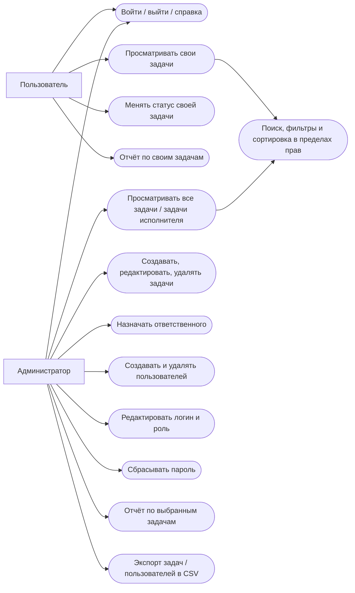
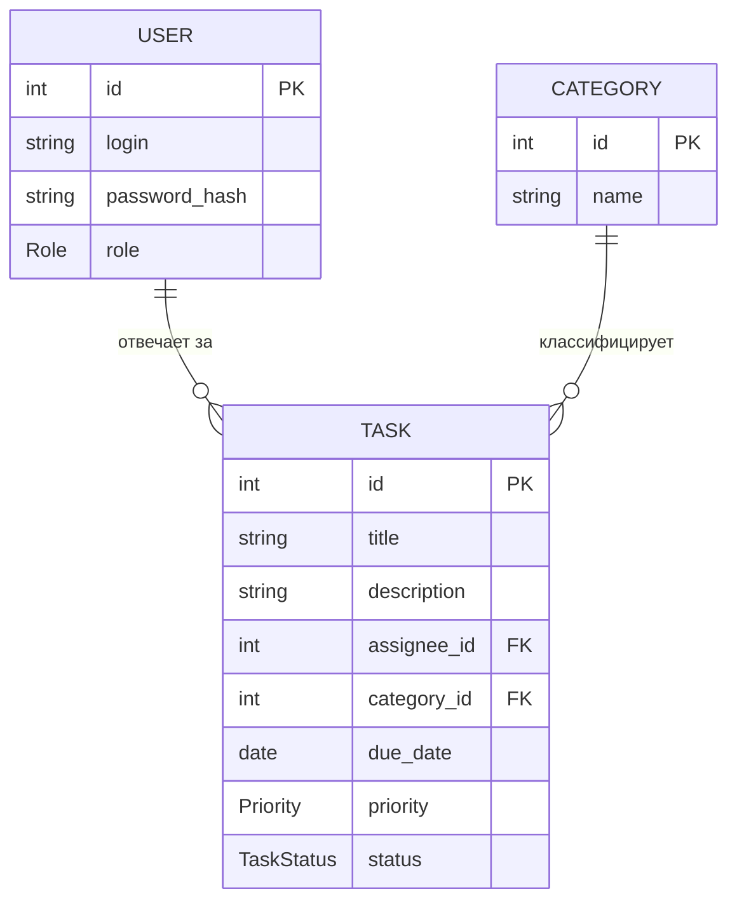
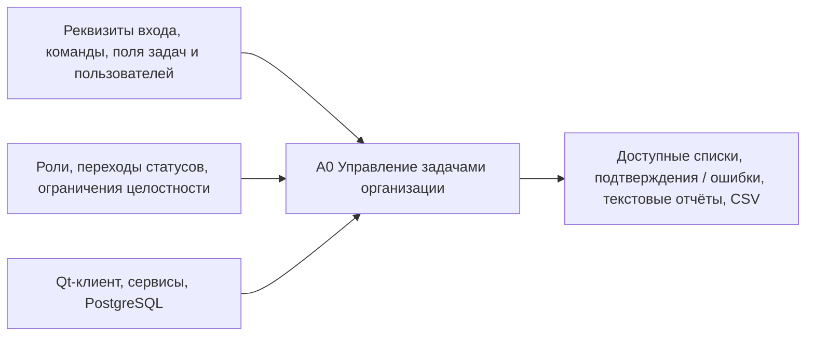
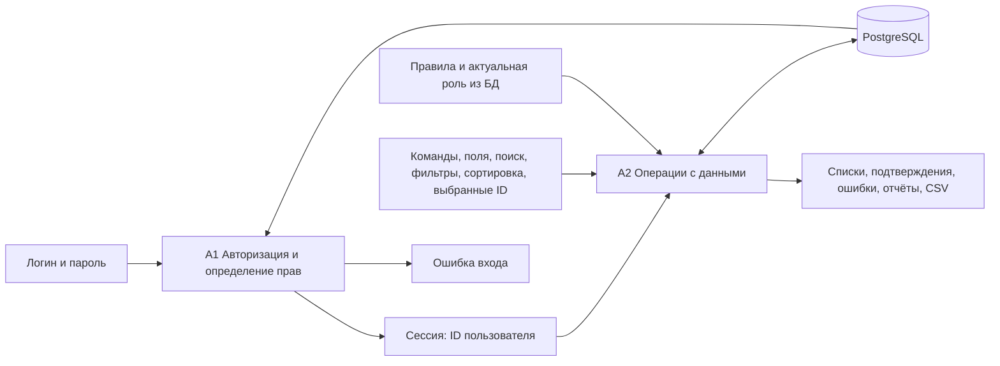
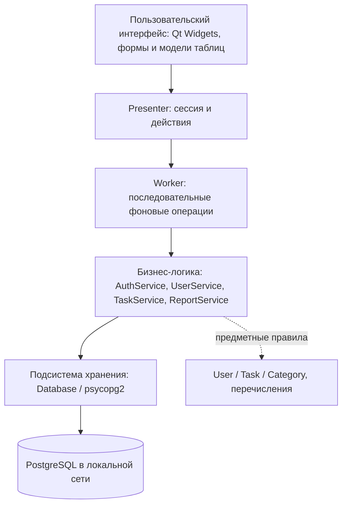
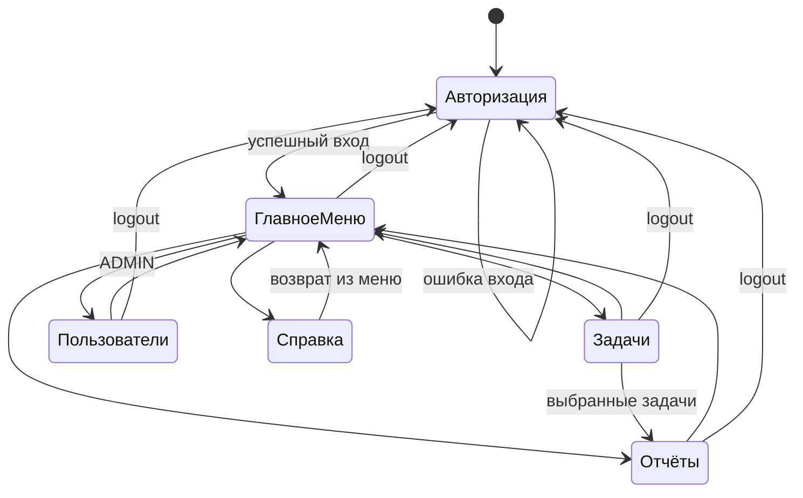

# Схемы для РПЗ

Схемы отражают реализованную программу. Исходные утверждённые схемы не предоставлялись; это материалы к реализации, не изменение ТЗ. Классы детализированы в `diagrams/classes.puml` (три секции: имя, поля, методы). Mermaid-блоки ниже можно открыть в редакторе с поддержкой Mermaid. Готовые SVG и редактируемый многостраничный файл draw.io расположены в `diagrams/`.

## 1. Варианты использования

Редактирование задач администратором включает допустимое изменение статуса. Правило переходов одинаково для обеих ролей. Управление категориями через GUI отсутствует.

## 2. Концептуальная модель

У User и Category может не быть задач. У Task всегда ровно один User и одна Category. Отчёт — временный текст, не сущность БД.

## 3. Функциональная схема A0, A1 / A2

A1 выдаёт сессию, не неизменяемый набор прав. A2 перечитывает роль для каждого защищённого действия. Схемы показывают потоки функций; готовый SVG также располагает управляющие воздействия сверху, механизмы снизу.

## 4. Структурная схема

## 5. Классы

Полная диаграмма — `diagrams/classes.puml` / `diagrams/05-classes.svg`. Ассоциации моделей не являются наследованием. TaskService проверяет доступ и сохранение, Task.change_status — предметное правило. User.password_hash заполняется только для внутренней аутентификации; объекты, возвращаемые GUI, содержат пустое значение этого поля.

Сигнатуры используют `Session`, а не роль, переданную формой. `get_tasks(session, query)` возвращает TaskList: задачи, серверную дату и безопасного текущего пользователя. `get_selected(session, ids)` повторно проверяет доступ к каждому ID. TaskInput и TaskQuery — простые переносчики данных, не постоянные таблицы.

## 6. Граф состояний интерфейса

Справка может открываться из любого рабочего раздела и возвращает именно в него. Для любого экрана применяется общий переход: попытка завершить приложение → «Подтверждение выхода» → «Отмена» в исходный экран или «Выйти» в завершение. Logout очищает пользовательский контекст, а не завершает процесс. Во время выполняющейся операции подтверждённый выход ожидает её окончания; автоматического сохранения несохранённых форм нет.
